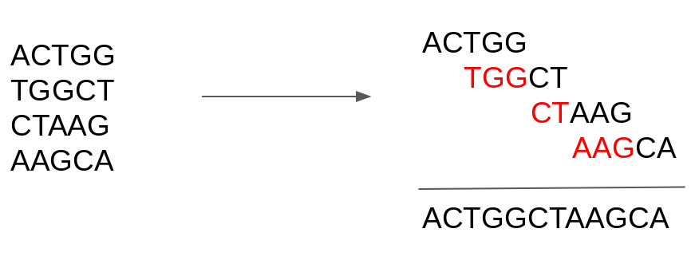
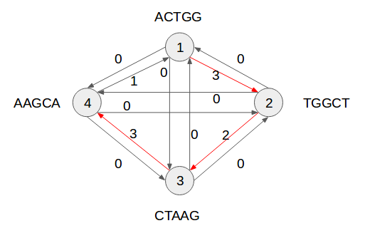

# Shortest common superstring (SCS) 

Every individual contains a genetic code that describes its appearance, characteristics and abilities known as genome. In biology, there are many uses to understand which are the important parts of a genome (genes) and what each of these genes is responsible for activating in the body. However, this task is not simple, one of the difficulties of detecting genes is not knowing exactly where in the genome the information is. Therefore, since a genome has many nucleotides a common practice in attempting to ease such process (and make it computable) is to break down the information obtained from the DNA into several distinct fragments, and to attempt to reconstruct the sequence therefrom. A technique used for this purpose is the shortest common superstring (SCS) algorithms. Although able to get good consensus sequences, generally, the algorithms used are greedy heuristics and therefore do not always generate the optimal results. This code is an implementation of a greedy heuristic based on overlapping graphs 

A shortest common superstring (SCS) is the smallest possible consensus sequence generated from all fragments of some alphabet. An example of SCS can be seen bellow. The problem is NP-difficult and seeks to maximize fragment overlap.

**SCS short example:**

## Greedy concept

The greedy SCS algorithm was implemented using a heuristic considering the largest possible edges of an overlapping graph. For this procedure, a graph G (V, E) was constructed in which each vertex V referred to a fragment and the edges E were weighted according to the size of the overlap of the fragments for each pair of vertices. 

During this process, the overlapping of each fragment f is calculated for the whole set of fragments F. From this, an array of weights is constructed with all computed overlap values. Each row of the array is referenced to the vertex used as a prefix and each column the vertex used for suffix. The algorithm acts on the array by choosing the highest weight edge and checking whether the input and output vertices (prefix, suffix) have no more than one input edge or more than one output already chosen. If there is no restriction on the choice of vertex it is included in a Hamiltonian path. Once the path is generated the greedy SCS can be constructed considering the overlap values between each pair of vertices

**SCS graph example:**

